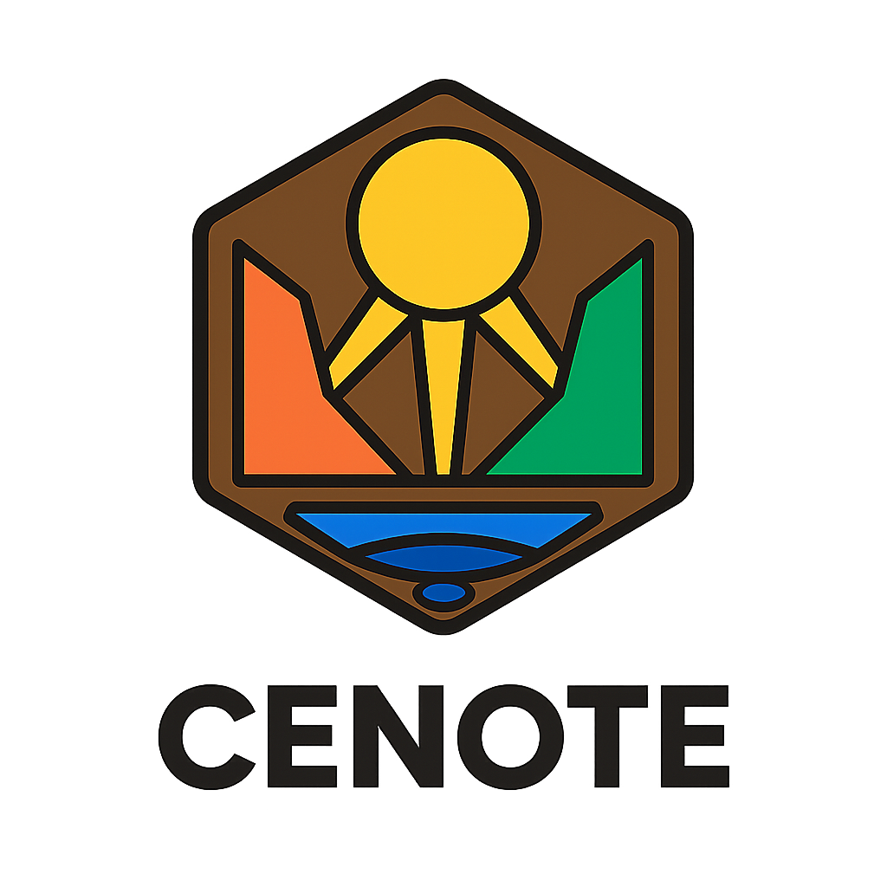

  <picture>
  <source srcset="logos/logo11.png" media="(prefers-color-scheme: dark)">
	<source srcset="logos/logo12.png" media="(prefers-color-scheme: light)">
	
	</picture> 

A cenote is a place of depth and mystery - the Mayans considered them sacred, portals to the underworld, sources of knowledge and water (life).
When you are in Cenote, you're in a browser based workspace that is built for learning. It's contemplative. Focused. You're inside an environment that keeps you focused, not letting you getting pulled away by distractions. 

 

Follow us if you want to see how Cenote develops. We hope to have an MVP out by the beginning of March 2026! 

### Core Team

<table>
  <tr>
    <td align="center"><a href="https://github.com/zachariaswik"> <b>Erik</b></a> <a href="#SoftwareDevelopment-Fernando" title="Software Development">💻💼</a></td>
  </tr>
</table>
 

### Contributors ✨

<!-- ALL-CONTRIBUTORS-LIST:START - Do not remove or modify this section -->
<!-- prettier-ignore-start -->
<!-- markdownlint-disable -->
<table>
  <tr>
    <td align="center"><a href="https://github.com/sito8943"> <b>Carlos</b></a> <a href="#SoftwareDevelopment-Carlos" title="Software Development">💻</a></td>
  </tr>
</table>

<!-- markdownlint-restore -->
<!-- prettier-ignore-end -->

<!-- ALL-CONTRIBUTORS-LIST:END -->

