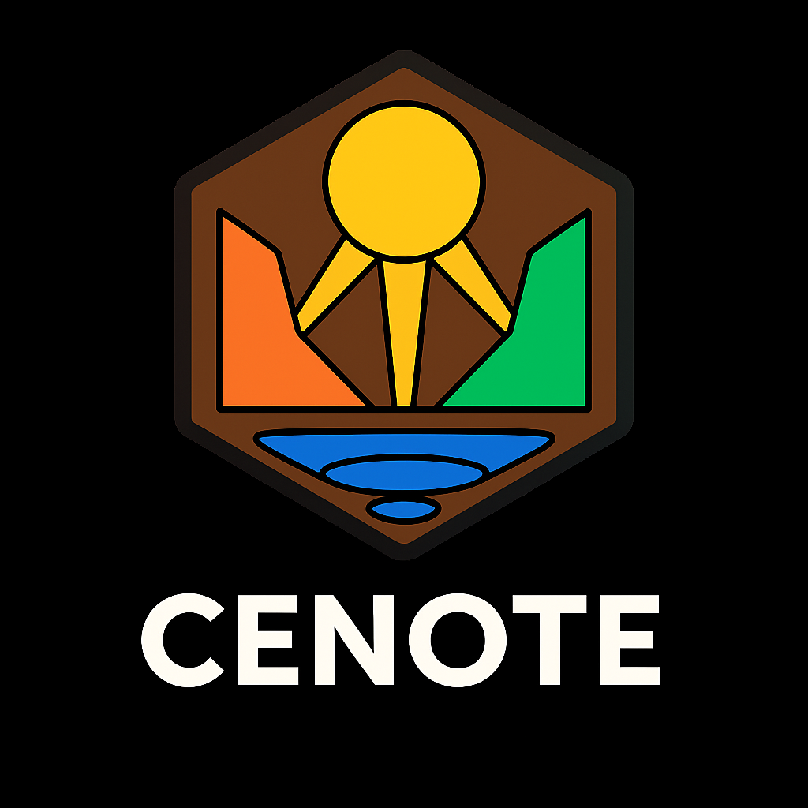

  <picture>
    
  </picture>

Children are constantly exposed to unproductive temptations with unrestricted browsing and desktop applications on their general-purpose computers. Instead of learning how to use technology, they are being used by it. Parents and educators rely on fragile, bypassable controls. 

Cenote solves this by creating a layer on top of your Mac, Windows or ChromeOS with a distraction-free environment that supports deep focus and controlled learning.

 

Follow us if you want to see how Cenote develops. We hope to have an MVP out by the beginning of March 2026! 

### Core Team

<table>
  <tr>
    <td align="center"><a href="https://github.com/zachariaswik"> <b>Erik</b></a> <a href="#SoftwareDevelopment-Fernando" title="Software Development">💻💼</a></td>
  </tr>
</table>
 

### Contributors ✨

<!-- ALL-CONTRIBUTORS-LIST:START - Do not remove or modify this section -->
<!-- prettier-ignore-start -->
<!-- markdownlint-disable -->
<table>
  <tr>
    <td align="center"><a href="https://github.com/sito8943"> <b>Carlos</b></a> <a href="#SoftwareDevelopment-Carlos" title="Software Development">💻</a></td>
  </tr>
</table>

<!-- markdownlint-restore -->
<!-- prettier-ignore-end -->

<!-- ALL-CONTRIBUTORS-LIST:END -->

